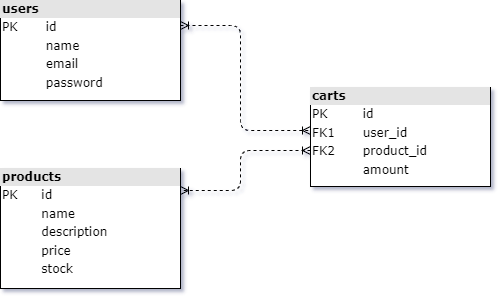

# Shopping Cart Project

## Table of Contents
- [Project Description](#project-description)
- [Features](#features)
- [Prerequisites](#prerequisites)
- [Setup Instructions](#setup-instructions)
- [Environment Variables](#environment-variables)
- [Project Structure](#project-structure)
- [Usage](#usage)
- [API Endpoints](#api-endpoints)
- [Database Schema](#database-schema)
- [Wireframe](#wireframe)

## Project Description

The Shopping Cart Project is a web application built using Node.js and Express.js that allows users to register, log in, view products, add products to their cart, and make payments. The application uses MySQL for data storage.

## Features

- User Authentication (Registration & Login)
- Product Listing
- Shopping Cart Management
- Payment Processing
- Flash Messages for User Feedback
- Session Management

## Prerequisites

Before you begin, ensure you have met the following requirements:

- Node.js installed on your machine
- MySQL server installed and running
- A MySQL database created for the project

## Setup Instructions

1. **Clone the Repository**

    ```sh
    git clone <repository-url>
    cd shopping-cart
    ```

2. **Install Dependencies**

    ```sh
    npm install
    ```

3. **Configure Environment Variables**

   Create a `.env` file in the root of the project and add the following environment variables:

    ```env
    DB_HOST=localhost
    DB_PORT=3306
    DB_USER=your_database_user
    DB_PASS=your_database_password
    DB=your_database_name
    JWT_SECRET=your_jwt_secret
    JWT_EXPIRES_IN=90d
    JWT_COOKIE_EXPIRES=90
    ```

4. **Set Up the Database**

   Import the database schema and initial data into your MySQL database:
   - find the *shop_db.sql* file in the *shopping-cart/db* directory, 
   - or use the following SQL script:

    ```sql
    CREATE TABLE users (
        id INT AUTO_INCREMENT PRIMARY KEY,
        name VARCHAR(255) NOT NULL,
        email VARCHAR(255) NOT NULL UNIQUE,
        password VARCHAR(255) NOT NULL
    );

    CREATE TABLE products (
        id INT AUTO_INCREMENT PRIMARY KEY,
        name VARCHAR(255) NOT NULL,
        description TEXT,
        price DECIMAL(10, 2) NOT NULL,
        stock INT NOT NULL,
        image VARCHAR(255)
    );

    CREATE TABLE carts (
        id INT AUTO_INCREMENT PRIMARY KEY,
        user_id INT NOT NULL,
        prod_id INT NOT NULL,
        amount INT NOT NULL,
        FOREIGN KEY (user_id) REFERENCES users(id),
        FOREIGN KEY (prod_id) REFERENCES products(id)
    );

    INSERT INTO products (name, description, price, stock, image) VALUES
    ('Product 1', 'Description for Product 1', 19.99, 100, '1.jpg'),
    ('Product 2', 'Description for Product 2', 29.99, 150, '2.jpg'),
    ('Product 3', 'Description for Product 3', 39.99, 200, '3.jpg'),
    ('Product 4', 'Description for Product 4', 49.99, 250, '4.jpg'),
    ('Product 5', 'Description for Product 5', 59.99, 300, '5.jpg'),
    ('Product 6', 'Description for Product 6', 69.99, 350, '6.jpg'),
    ('Product 7', 'Description for Product 7', 79.99, 400, '7.jpg'),
    ('Product 8', 'Description for Product 8', 89.99, 450, '8.jpg'),
    ('Product 9', 'Description for Product 9', 99.99, 500, '9.jpg');
    ```

5. **Run the Application**

    ```sh
    npm start
    ```

   The server will start on `http://localhost:3000`.

## Environment Variables

The following environment variables are used in the project:

- `DB_HOST`: Hostname for the database server
- `DB_PORT`: Port number for the database server
- `DB_USER`: Database user
- `DB_PASS`: Database password
- `DB`: Database name
- `JWT_SECRET`: Secret key for JWT
- `JWT_EXPIRES_IN`: JWT expiration time
- `JWT_COOKIE_EXPIRES`: JWT cookie expiration time in days

## Project Structure

```plaintext
shopping-cart/
├── bin/
│   └── www
├── db/
│   ├── shop_db.sql
│   ├── shop_db_uml.no_background.png
│   └── shop_db_uml.png
├── controllers/
│   ├── auth.js
│   ├── cart.js
│   └── payment.js
├── node_modules/
├── public/
│   ├── images/
│   └── stylesheets/
├── routes/
│   ├── auth.js
│   ├── cart.js
│   ├── pages.js
│   └── payment.js
├── views/
│   ├── cart.ejs
│   ├── error.ejs
│   ├── index.ejs
│   ├── login.ejs
│   ├── payment.ejs
│   ├── register.ejs
│   └── shop.ejs
├── .env
├── .gitignore
├── app.js
├── package.json
├── package-lock.json
└── README.md
```

## Usage

### User Registration

1. Go to `http://localhost:3000/register`
2. Fill in the registration form and submit.

### User Login

1. Go to `http://localhost:3000/login`
2. Fill in the login form and submit.

### Viewing Products

1. Go to `http://localhost:3000/shop`
2. Browse through the list of products.

### Adding Products to Cart

1. View a product and click on the "Add to Cart" button.
2. Go to `http://localhost:3000/cart` to view your cart.

### Making a Payment

1. Go to `http://localhost:3000/payment`
2. Follow the payment instructions.

## API Endpoints

### Authentication

- `POST /auth/register` - Register a new user
- `POST /auth/login` - Login an existing user

### Cart

- `GET /cart` - View cart
- `POST /cart/add` - Add product to cart

### Payment

- `POST /payment/success` - Payment success

### Pages

- `GET /` - Home page
- `GET /shop` - Shop page
- `GET /login` - Login page
- `GET /register` - Register page
- `GET /cart` - Cart page
- `GET /payment` - Payment page

## Database Schema

### Users Table

```sql
CREATE TABLE users (
    id INT AUTO_INCREMENT PRIMARY KEY,
    name VARCHAR(255) NOT NULL,
    email VARCHAR(255) NOT NULL UNIQUE,
    password VARCHAR(255) NOT NULL
);
```

### Products Table

```sql
CREATE TABLE products (
   id INT AUTO_INCREMENT PRIMARY KEY,
   name VARCHAR(255) NOT NULL,
   description TEXT,
   price DECIMAL(10, 2) NOT NULL,
   stock INT NOT NULL
);
```

### Carts Table

```sql
CREATE TABLE carts (
   id INT AUTO_INCREMENT PRIMARY KEY,
   user_id INT NOT NULL,
   prod_id INT NOT NULL,
   amount INT NOT NULL,
   FOREIGN KEY (user_id) REFERENCES users(id),
   FOREIGN KEY (prod_id) REFERENCES products(id)
);
```

### DB Tables UML




## Wireframe
